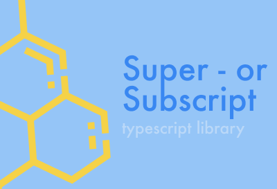

<h1 align="center">Super- or Sub Script</h1>

A package to Type Super or Subscript In HTML inputs with minimal setup.

<p align="center">

</p>
<p align="center">
  <a href="">
    
  </a>
  <br>
</p>

This is a package that solves and Issue I had some time ago. How to write Chemical Formulas on A websire without knowing difficult Key Combos.

This solves a very spesific propblem and the only reason to make it a package is for someone who might need to do something similar and will be able to fork from or find insperiation form this.

## How it works

It adds an Eventlister when initialized for `focusin`.

It also adds a Eventlister for `keydown`.

So when a user focuses on an input and presses the keycomo the packages will "inject" the unicode char for the SubScrip or SuperScript.

Under the hood it uses [KeyboardEvent.code](https://developer.mozilla.org/en-US/docs/Web/API/KeyboardEvent/code) as apose to the unrecommend and depricated [KeyboardEvent.keyCode](https://developer.mozilla.org/en-US/docs/Web/API/KeyboardEvent/keyCode).

Currently the only supported Key combonatiation are `ctrlKey` + `shiftKey` + `1 2 3 4 5 6 7 8 9 0 - +`

## How To use it.

```js
import { SuperorSub } from 'superorsub';

const { toggelSuperorSub } = new SuperorSub({
  isSuper: true,
});
```

### Initiate Class

Setting `isSuper` to true will make it Type in Super Script, setting it to false will make it Subscript.

### Props/Methods

|                             | Type   | Info                                                                                  |
| --------------------------- | ------ | ------------------------------------------------------------------------------------- |
| `toggelSuperorSub(boolean)` | method | Passing a boolean in this method will change the isSuper to whatever value is passed. |

So you can initate the Class and set is Super and leave it if only Super or Sub script is neasaserry. With `toggelSuperorSub` you can make the user toggel between that.

## TODO / ISSUES

- Let user select Key Combos To Trigger
- Add more options than just Numeric Chars (Full list of Alphanumeric)
